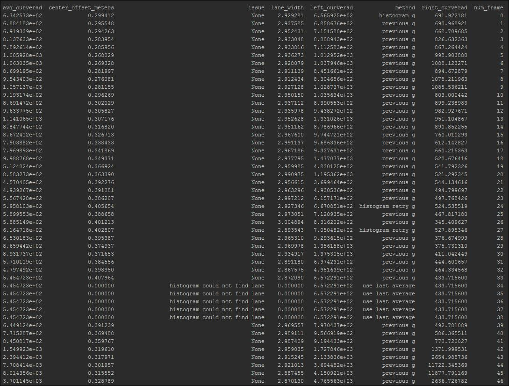

## Advanced Lane Finding Project

The goals / steps of this project are the following:

* Compute the camera calibration matrix and distortion coefficients given a set of chessboard images.
* Apply a distortion correction to raw images.
* Use color transforms, gradients, etc., to create a thresholded binary image.
* Apply a perspective transform to rectify binary image ("birds-eye view").
* Detect lane pixels and fit to find the lane boundary.
* Determine the curvature of the lane and vehicle position with respect to center.
* Warp the detected lane boundaries back onto the original image.
* Output visual display of the lane boundaries and numerical estimation of lane curvature and vehicle position.

[//]: # (Image References)

## [Rubric](https://review.udacity.com/#!/rubrics/571/view) Points

### Here I will consider the rubric points individually and describe how I addressed each point in my implementation.

---

### Writeup / README

#### 1. Provide a Writeup / README that includes all the rubric points and how you addressed each one.  You can submit your writeup as markdown or pdf.  [Here](https://github.com/udacity/CarND-Advanced-Lane-Lines/blob/master/writeup_template.md) is a template writeup for this project you can use as a guide and a starting point.

You're reading it!

### Camera Calibration

#### 1. Briefly state how you computed the camera matrix and distortion coefficients. Provide an example of a distortion corrected calibration image.

The code for this step is contained in the function calibrate_camera() located in model.py

I start by preparing "object points", which will be the (x, y, z) coordinates of the chessboard corners in the world. Here I am assuming the chessboard is fixed on the (x, y) plane at z=0, such that the object points are the same for each calibration image.  Thus, `objp` is just a replicated array of coordinates, and `objpoints` will be appended with a copy of it every time I successfully detect all chessboard corners in a test image.  `imgpoints` will be appended with the (x, y) pixel position of each of the corners in the image plane with each successful chessboard detection.

I then used the output `objpoints` and `imgpoints` to compute the camera calibration and distortion coefficients using the `cv2.calibrateCamera()` function.  I applied this distortion correction to the test image using the `cv2.undistort()` function and obtained this result:

Before undistort 

After undistort 

### Pipeline (single images)

#### 1. Provide an example of a distortion-corrected image.

Below is an example application of distortion correction on a single image:

Before undistort 

After undistort 

#### 2. Describe how (and identify where in your code) you used color transforms, gradients or other methods to create a thresholded binary image.  Provide an example of a binary image result.

I used a combination of color and gradient thresholds to generate a binary image in function generate_binary() in file model.py. First, I convert the image to HLS color space and separate the L channel. Next, I used sobel to take the absolute derivative in x to accentuate lines away from horizontal. I then threshold the x gradient and color channel. 

Here's an example of my output for this step.

#### 3. Describe how (and identify where in your code) you performed a perspective transform and provide an example of a transformed image.

The code for my perspective transform is located in function perspective_transform() in file `model.py`. The `perspective_transform()` function uses manually selected source and destination coordinate points and uses cv2.getPerspectiveTransform() to return both the perspective transform matrix and inverse perspective transform matrix.

This resulted in the following source and destination points:

| Source        | Destination   |
|:-------------:|:-------------:|
| 200, 720      | 350, 720      |
| 570, 470      | 350, 0        |
| 720, 7470     | 980, 0        |
| 1130, 720     | 980, 720      |

I verified that my perspective transform was working as expected by drawing the `src` and `dst` points onto a test image and its warped counterpart to verify that the lines appear parallel in the warped image.

#### 4. Describe how (and identify where in your code) you identified lane-line pixels and fit their positions with a polynomial?

I have a master function called find_lane() in file model.py and given the RGB channels of the binary warped image, it finds the lane lines using various methods. This method is called ONCE per image. calc_line() is another helper function and is called multiple times to find the most optimal line. Given a binary warped image and the polynomial coefficients for the left and right lane, calc_line() will calculate the polynomial fits and then check if it makes sense. If it doesn't make sense, then this method will be called again with other parameters.

Binary warped image: 

Binary warped image with plotted line: 

#### 5. Describe how (and identify where in your code) you calculated the radius of curvature of the lane and the position of the vehicle with respect to center.

Calculation of the radius of the curvation was also done in the function calc_lane() in file model.py. I also calculated the maximum lane width in meters, lane width at the bottom of the screen in meters, and offset from center in meters. I used all of this to determine if the found lanes lines were found by comparing them across images and then coming up with a threshold.

#### 6. Provide an example image of your result plotted back down onto the road such that the lane area is identified clearly.

I implemented this in function draw_lane_lines() in model.py. It creates a blank image, plots the line on the blank image, then uses the inverse perspective matrix to overlay the lane line on top of the original image. 

Here is an example of my result on a test image:

---

### Pipeline (video)

#### 1. Provide a link to your final video output.  Your pipeline should perform reasonably well on the entire project video (wobbly lines are ok but no catastrophic failures that would cause the car to drive off the road!).

Here's a [link to my video result](./project_video_output.mp4)

---

### Discussion

#### 1. Briefly discuss any problems / issues you faced in your implementation of this project.  Where will your pipeline likely fail?  What could you do to make it more robust?

I thought this project was very challenging and also very rewarding. It helped to appreciate what a hard problem computer vision is. There were two main issues that I ran into. 

1. Organization - there were too many data to keep track of, to validate, and return. In addition to the Line() class, I added two more classes -- Calc_Lane_Results() and LaneLine(). Calc_Lane_Results was used to return calculated data back to the calling function and LaneLine() and MasterLaneLine() was used to keep track of everything across all frames of the video. Organizing the data helped me tremendously. 

2. Invalid Lane Lines - I think the main cause of invalid lane lines were shadows. At least that was what I observed using the video in the assignment. I had to be creative in how I checked for valid lane lines. One thing that helped was creating a pandas dataframe of stats that store most values such as lane width and curvature across all frames. I would then look for bad lane lines in the output video and compare it with the data that I output. This helped me come up with thresholds that would identify bad lane lines. 

The following is a sample output of the dataframe of stats: 

